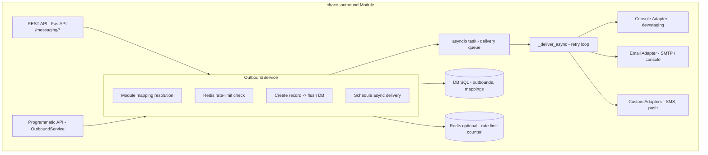
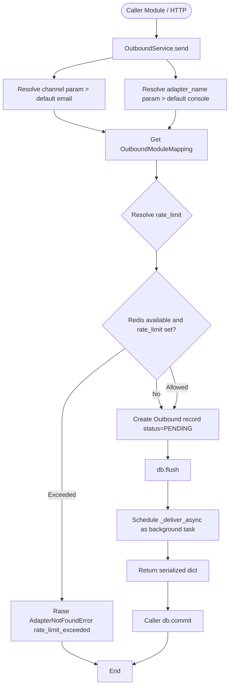
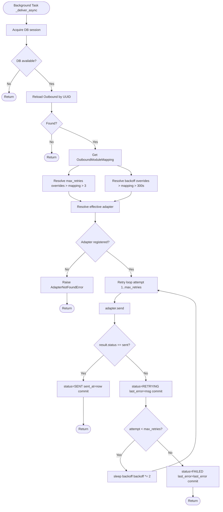
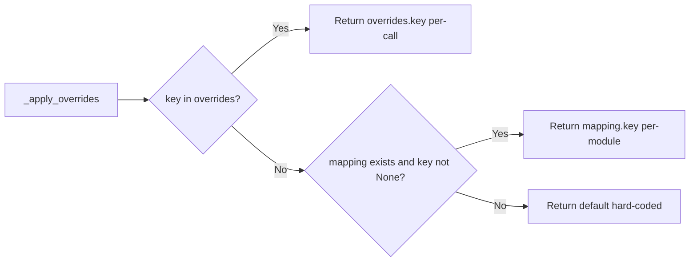
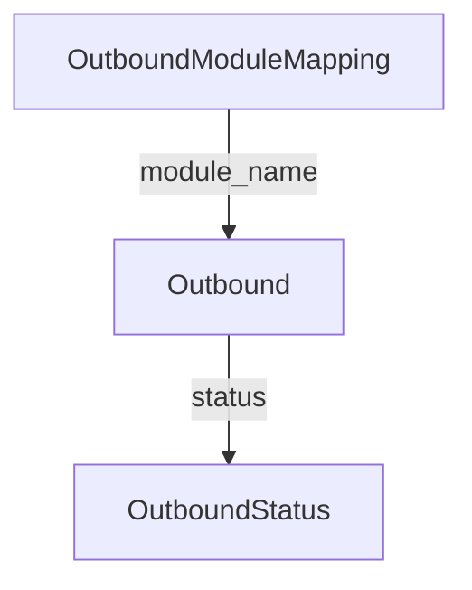

# ChaCC Outbound

A ChaCC module providing **outbound messaging via adapters** (email, SMS, push, etc.). Other modules enqueue outbound messages through a unified service API or REST endpoints without worrying about delivery mechanics.

## Features

- **Direct sends**: Send content directly with full control over subject, body, channel, and adapter
- **Email (HTML/Text)**: SMTP adapter + console adapter for development
- **SMS and more**: Extensible adapter pattern for SMS providers (Twilio, etc.)
- **Retry & backoff**: Automatic retries with configurable backoff per module
- **Async delivery**: Fire-and-forget with status tracking
- **Programmatic API**: Other modules use `OutboundService` directly — no HTTP required
- **REST API**: Admin endpoints for outbound records and sending

## Installation

1. Ensure the module is available in your ChaCC plugins directory:

```
plugins/chacc_outbound/
```

2. Install dependencies:

```bash
pip install -r plugins/chacc_outbound/requirements.txt
```

## Configuration

The module reads configuration from the ChaCC module context. Set these keys for your module:

| Key | Default | Description |
|-----|---------|-------------|
| `EMAIL_BACKEND` | `console` | Adapter to use: `console` for dev, `smtp` for production |
| `EMAIL_SMTP_HOST` | `""` | SMTP server host (required when `EMAIL_BACKEND=smtp`) |
| `EMAIL_SMTP_PORT` | `587` | SMTP server port |
| `EMAIL_SMTP_USERNAME` | `""` | SMTP authentication username |
| `EMAIL_SMTP_PASSWORD` | `""` | SMTP authentication password |
| `EMAIL_SMTP_FROM` | `noreply@example.com` | Default sender email address |
| `ENVIRONMENT` | `development` | Environment name |

### Example: SMTP configuration

```python
# In your module's config or environment
EMAIL_BACKEND=smtp
EMAIL_SMTP_HOST=smtp.example.com
EMAIL_SMTP_PORT=465
EMAIL_SMTP_USERNAME=user@example.com
EMAIL_SMTP_PASSWORD=your_password
EMAIL_SMTP_FROM=alerts@yourapp.com
```

When `EMAIL_BACKEND=console` or `EMAIL_SMTP_HOST` is empty, messages print to stdout instead of sending.

## Quick Start

### From another module (programmatic)

```python
from chacc_outbound_src.context_factory import get_outbound_service, get_db

# Get the service from context
outbound_service = get_outbound_service()

# Send a message
async for db in get_db():
    result = await outbound_service.send(
        db=db,
        recipient_id=customer.id,
        recipient_contact=customer.email,
        subject="Your order has shipped",
        body="Your order ORD-001 has been shipped. Tracking: TRK-456",
        module_name="order_service",
        channel="email",
    )
    # result is a dict: uuid, module_name, recipient_id, channel, subject, body, ...
    await db.commit()
```

### Via REST API

```bash
curl -X POST http://localhost:8085/outbound/send \
  -H "Content-Type: application/json" \
  -d '{
    "module_name": "order_service",
    "recipient_id": "cust_123",
    "recipient_contact": "customer@example.com",
    "subject": "Order shipped",
    "body": "Your order ORD-001 has been shipped.",
    "channel": "email",
    "adapter_name": "console",
    "content_type": "text/plain"
  }'
```

## Sending Messages

### Direct send (`send`)

Bypasses template lookup. Use this for all messaging — content is passed directly.

```python
# Email - text (default)
result = await outbound_service.send(
    db=db,
    recipient_id="cust_123",
    recipient_contact="customer@example.com",
    subject="Urgent: Action required",
    body="Please update your payment method.",
    module_name="billing_service",
    channel="email",
    adapter_name="smtp",
)

# Email - HTML
result = await outbound_service.send(
    db=db,
    recipient_id="cust_123",
    recipient_contact="customer@example.com",
    subject="Order confirmation",
    body="<h1>Order ORD-001 confirmed</h1><p>Thank you for your purchase.</p>",
    module_name="order_service",
    channel="email",
    adapter_name="smtp",
    content_type="html",
)

# SMS (subject not used, content_type defaults to text/plain)
result = await outbound_service.send(
    db=db,
    recipient_id="cust_123",
    recipient_contact="+255712345678",
    body="Your OTP is 123456",
    module_name="auth_service",
    channel="sms",
    adapter_name="twilio",
)
```

| Parameter | Email | SMS |
|-----------|-------|-----|
| `subject` | Required | Ignored |
| `content_type` | `text/plain` (default) or `html` | Not required (defaults to `text/plain`) |

## Module Mapping

Define per-module defaults for adapter, channel, and retry policy via `OutboundModuleMapping`.

```python
mapping = outbound_service.create_or_update_module_mapping(
    db=db,
    module_name="order_service",
    max_retry_attempts=5,
    retry_backoff_seconds=60,
    description="Order notifications with aggressive retry",
)
await db.commit()
```

These defaults apply when a send call does not specify the corresponding parameter.

## REST API Reference

| Method | Endpoint | Description |
|--------|----------|-------------|
| `POST` | `/outbound/send` | Send message |
| `GET` | `/outbound/messages` | List outbound records (filter: `module_name`, `channel`, `status`) |
| `GET` | `/outbound/messages/{uuid}` | Get outbound record by UUID |
| `GET` | `/outbound/messages/{uuid}/status` | Get outbound status by UUID |

## Retrieving Messages

# Get status only
status = outbound_service.get_status(db, outbound_uuid)

Implement `BaseOutboundAdapter` to add new channels (SMS, push, etc.).

```python
from chacc_outbound_src.adapters.base import BaseOutboundAdapter, SendResult

class SMSOutboundAdapter(BaseOutboundAdapter):
    name = "twilio"
    channel = "sms"

    async def send(
        self,
        messaging_uuid: str,
        recipient_id: str,
        recipient_contact: str,
        metadata: Optional[dict] = None,
        subject: Optional[str] = None,
        body: Optional[str] = None,
        content_type: str = "text/plain",
    ) -> SendResult:
        # Send via Twilio
        message = client.messages.create(
            body=body or "",
            from_="+1234567890",
            to=recipient_contact,
        )
        return SendResult(status="sent", message_id=message.sid)

    async def validate_contact(self, contact: str) -> bool:
        return contact.startswith("+")
```

Register the adapter in `setup_plugin()`:

```python
from chacc_outbound_src.adapters import OutboundAdapterRegistry, SMSOutboundAdapter

registry = OutboundAdapterRegistry()
registry.register(
    adapter=SMSOutboundAdapter(),
    channel="sms",
    name="twilio",
    set_default=True,
)
```

## Error Handling

The service raises specific exceptions:

- `AdapterNotFoundError` — no adapter registered for the channel

```python
from chacc_outbound_src.exceptions import AdapterNotFoundError

try:
    result = await outbound_service.send(...)
except AdapterNotFoundError as e:
    # Handle missing adapter
```

## Architecture

### Component Overview



### Message Flow: Direct Send (`send()`)



### Async Delivery Flow (`_deliver_async()`)



### Override Resolution



### Data Model Relationships



### Adapter Interface

```python
class BaseOutboundAdapter:
    name: str              # e.g. "console", "smtp", "twilio"
    channel: str           # e.g. "email", "sms"

    async def send(...) -> SendResult
    async def validate_contact(contact: str) -> bool
```

## Running Tests

```bash
pytest plugins/chacc_outbound/chacc_outbound_src/tests/ -v
```

Or using the standalone runner:

```bash
python plugins/chacc_outbound/chacc_outbound_src/run_tests.py
```

## Project Structure

```
plugins/chacc_outbound/
├── chacc_outbound_src/
│   ├── main.py              # Plugin entry point
│   ├── config.py            # Configuration loader
│   ├── context_factory.py   # Context and service access helpers
│   ├── models.py            # SQLAlchemy models
│   ├── exceptions.py        # Custom exceptions
│   ├── service.py           # Core outbound service
│   ├── routes.py            # REST API routes
│   ├── adapters/
│   │   ├── __init__.py
│   │   ├── base.py          # Abstract adapter base
│   │   ├── email.py         # SMTP email adapter
│   │   └── console.py       # Console adapter for dev
│   ├── tests/
│   │   ├── __init__.py
│   │   └── test_module.py
│   └── run_tests.py
├── module_meta.json
├── requirements.txt
└── README.md
```

## License

MIT
