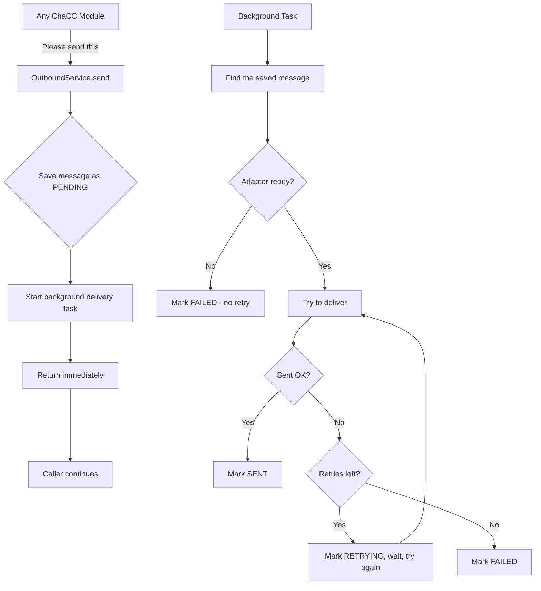
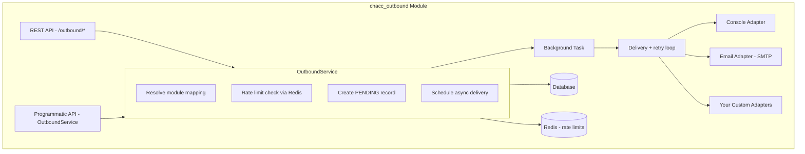
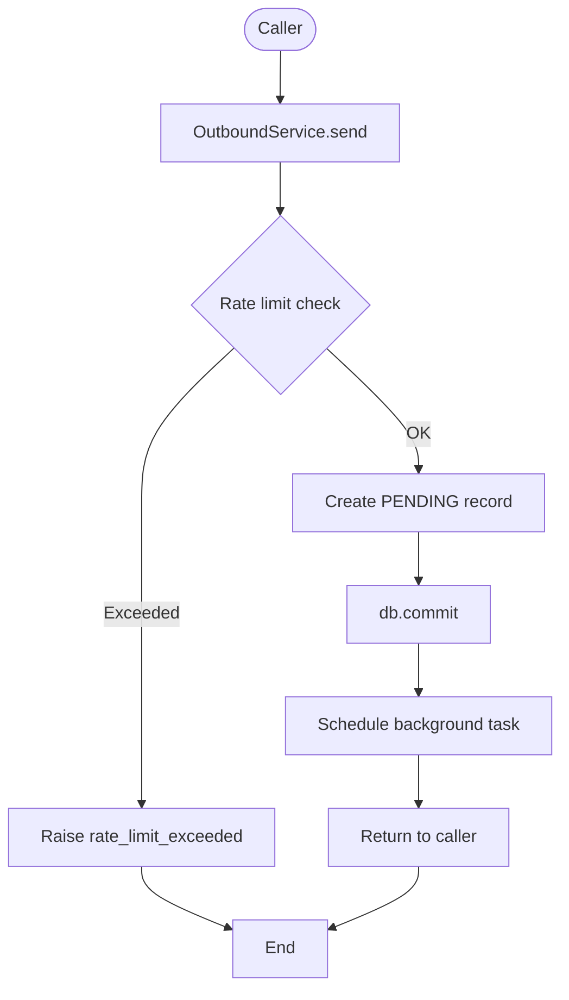
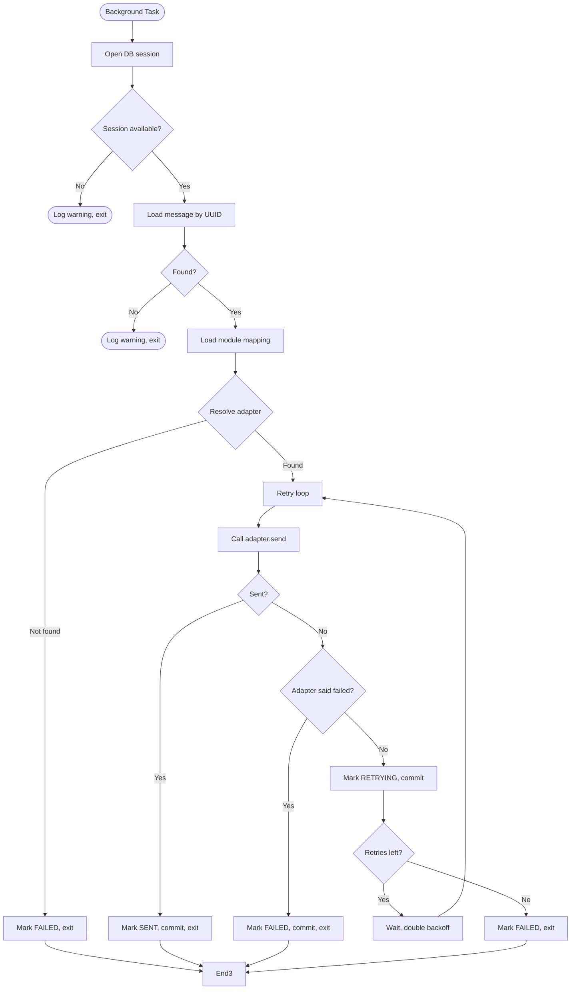

# Chacc Outbound

Send emails, SMS, and other messages from any ChaCC module — with automatic retries, status tracking, and a clean admin API.

## What this module does

Think of this as your app's **messaging helper**. Other modules say *"send this email to this customer"* and chacc_outbound handles:

- Choosing the right delivery method (SMTP, console for dev, etc.)
- Saving the message record so you can track it
- Retrying if delivery fails
- Updating the status so you know what happened

You don't need to know SMTP, Twilio, or any provider details. Just call `send()` and the module figures out the rest.

## Before you start

Make sure this folder is inside your ChaCC plugins directory:

```
plugins/chacc_outbound/
```
> Dependencies will be taken care by `chacc-api`

## Settings

Settings are shared across the whole app via environment variables. Pick the adapter that matches your environment.

### Console (development)

No extra setup needed. Messages are printed to the console instead of being sent anywhere. Great for testing.

```bash
CHACC_OUTBOUND_EMAIL_BACKEND=console
```

### SMTP (production email)

| Setting | What it is | Example |
|---------|-----------|---------|
| `CHACC_OUTBOUND_EMAIL_BACKEND` | Use `smtp` for real email | `smtp` |
| `CHACC_OUTBOUND_EMAIL_SMTP_HOST` | Your mail server address | `smtp.mailprovider.com` |
| `CHACC_OUTBOUND_EMAIL_SMTP_PORT` | Usually `465` (SSL) or `587` (STARTTLS) | `465` |
| `CHACC_OUTBOUND_EMAIL_SMTP_USERNAME` | Login for your mail server | `alerts@yourapp.com` |
| `CHACC_OUTBOUND_EMAIL_SMTP_PASSWORD` | Password or app-specific password | `hunter2` |
| `CHACC_OUTBOUND_EMAIL_SMTP_FROM` | The "from" address on outgoing emails | `noreply@yourapp.com` |
| `CHACC_OUTBOUND_EMAIL_SMTP_USE_TLS` | Set `true` if your server needs explicit TLS | `true` |

```bash
CHACC_OUTBOUND_EMAIL_BACKEND=smtp
CHACC_OUTBOUND_EMAIL_SMTP_HOST=smtp.mailprovider.com
CHACC_OUTBOUND_EMAIL_SMTP_PORT=465
CHACC_OUTBOUND_EMAIL_SMTP_USERNAME=alerts@yourapp.com
CHACC_OUTBOUND_EMAIL_SMTP_PASSWORD=your_password
CHACC_OUTBOUND_EMAIL_SMTP_FROM=noreply@yourapp.com
CHACC_OUTBOUND_EMAIL_SMTP_USE_TLS=true
```

### Per-module behavior

You can tune how each module's messages behave without changing code:

| Setting | What it controls | Default |
|---------|-----------------|---------|
| `max_retry_attempts` | How many times to retry a failed send | `3` |
| `retry_backoff_seconds` | Initial wait between retries (doubles each time) | `300` (5 minutes) |
| `rate_limit_per_minute` | Max sends per minute for this module | none |
| `default_adapter_name` | Override the app-wide adapter for this module | app default |
| `default_channel` | Default channel if not specified per send | `email` |

## How it works

### The big picture



### The short version

1. **You ask to send a message** — the module saves a `PENDING` record and returns immediately.
2. **A background task picks it up** — it opens its own database connection and tries to deliver.
3. **Success** — the record becomes `SENT`.
4. **Temporary failure** — the record becomes `RETRYING`, waits, and tries again.
5. **Permanent failure** — the record becomes `FAILED` and stops retrying.

### Message life cycle

```
PENDING → SENT     (delivered successfully)
PENDING → RETRYING → SENT     (succeeded after retry)
PENDING → RETRYING → FAILED   (ran out of retries)
PENDING → FAILED   (missing config, bad adapter, etc.)
```

## Using it from another module

### Quick example

```python
from chacc_outbound_src.context_factory import get_outbound_service, get_db

outbound_service = get_outbound_service()

async for db in get_db():
    result = await outbound_service.send(
        db=db,
        recipient_id="cust_123",
        recipient_contact="customer@example.com",
        subject="Your order has shipped",
        body="Your order ORD-001 has shipped. Tracking: TRK-456",
        module_name="order_service",
        channel="email",
    )
    await db.commit()
```

The `result` is a dictionary with the message UUID and current status. Since delivery happens in the background, the status may still be `PENDING` at this point — it updates shortly after.

### What each option means

| Option | Required? | Notes |
|--------|-----------|-------|
| `recipient_id` | Yes | Your internal customer/order/user ID |
| `recipient_contact` | Yes | Email address or phone number |
| `subject` | For email | Ignored for SMS |
| `body` | Yes | The message content |
| `module_name` | Yes | Used for per-module settings and filtering |
| `channel` | No | Defaults to `email` |
| `adapter_name` | No | Override the default adapter for this send |
| `content_type` | No | `text/plain` or `html` (for email) |

## REST API

Base path: `/outbound`

### Send a message

```bash
curl -X POST http://localhost:8085/outbound/send \
  -H "Content-Type: application/json" \
  -d '{
    "module_name": "order_service",
    "recipient_id": "cust_123",
    "recipient_contact": "customer@example.com",
    "subject": "Order shipped",
    "body": "Your order ORD-001 has been shipped.",
    "channel": "email",
    "adapter_name": "console",
    "content_type": "text/plain"
  }'
```

### List messages

```bash
# Basic list
curl http://localhost:8085/outbound/messages

# Filter
curl "http://localhost:8085/outbound/messages?module_name=order_service&status=SENT"

# Search
curl "http://localhost:8085/outbound/messages?search=customer@example.com"

# Paginated
curl "http://localhost:8085/outbound/messages?page=1&size=20"

# No pagination (return all)
curl "http://localhost:8085/outbound/messages?paging=false"
```

| Query param | What it does |
|-------------|-------------|
| `page` | Page number, starting at 1 |
| `size` | Results per page (1 to 1000) |
| `paging` | Set `false` to return everything at once |
| `module_name` | Filter by module |
| `channel` | Filter by channel (`email`, `sms`, etc.) |
| `status` | Filter by status (`PENDING`, `SENT`, `RETRYING`, `FAILED`) |
| `search` | Search in UUID, module name, recipient contact, subject, and body |

Response shape:

```json
{
  "success": true,
  "message": "Data fetched successfully",
  "data": [ ... ],
  "total": 42,
  "pager": {
    "page": 1,
    "size": 10,
    "pages": 5
  }
}
```

### Get one message

```bash
curl http://localhost:8085/outbound/messages/019f90bf-a50b-7d13-8937-f6e98cabc71e
```

### Check status only

```bash
curl http://localhost:8085/outbound/messages/019f90bf-a50b-7d13-8937-f6e98cabc71e/status
```

Returns:

```json
{
  "uuid": "019f90bf-a50b-7d13-8937-f6e98cabc71e",
  "status": "SENT"
}
```

## Message statuses

| Status | Meaning |
|--------|---------|
| `PENDING` | Message was saved and is waiting to be delivered |
| `SENT` | Delivered successfully |
| `RETRYING` | Delivery failed, will try again |
| `FAILED` | Gave up. Check `last_error` for why |

## Debugging

### Nothing is being sent

1. Check the logs for `Adapter reported SENT` — if you see this, the adapter delivered successfully.
2. If you see `Adapter reported FAILED`, the adapter itself is failing. Check its config.
3. If you see `Adapter not found`, the adapter name is wrong or not registered.

### Status stays PENDING forever

1. Look for `Outbound delivery failed for <uuid>` — the background task crashed.
2. Look for `Background delivery task failed for <uuid>` — an unhandled exception killed the task.
3. If you see neither, the background task may not be starting. Check that the app is running and `module_context` is set.

### Emails send but DB doesn't update

This was a known issue caused by the database session closing before the status update. It has been fixed. If you still see it:

1. Check that your app is using the latest code.
2. Look for `marked as SENT in DB` in the logs — if you see this but the status is still `PENDING` when you query, the session may still be closing early.
3. Make sure `module_context.get_db()` is yielding a stable session for the full request lifecycle.

### Retry behavior looks wrong

- `AdapterConfigError` and `AdapterNotFoundError` **do not retry** — they mark the message `FAILED` immediately.
- SMTP connection errors **do retry** — the message goes to `RETRYING` and waits before trying again.
- Authentication errors and bad recipient addresses **do not retry** — they mark the message `FAILED`.

### Common config mistakes

| Symptom | Likely cause |
|---------|-------------|
| `AdapterConfigError` | `EMAIL_SMTP_HOST` is empty or wrong |
| `SMTPAuthenticationError` | Wrong username/password |
| `SMTPSenderRefused` | `EMAIL_SMTP_FROM` address is not allowed by your mail server |
| `SMTPServerDisconnected` | Firewall, wrong port, or server down |

## Extending with custom adapters

Want to send SMS, push notifications, or something else? Create an adapter:

```python
from chacc_outbound_src.adapters.base import BaseOutboundAdapter, SendResult

class SMSOutboundAdapter(BaseOutboundAdapter):
    name = "twilio"
    channel = "sms"

    async def send(self, messaging_uuid, recipient_id, recipient_contact, metadata=None, subject=None, body=None, content_type="text/plain"):
        # Your delivery logic here
        return SendResult(status="sent", message_id="twilio_123")

    async def validate_contact(self, contact):
        return contact.startswith("+")
```

Register it in `setup_plugin()`:

```python
from chacc_outbound_src.adapters import OutboundAdapterRegistry, SMSOutboundAdapter

registry = OutboundAdapterRegistry()
registry.register(adapter=SMSOutboundAdapter(), channel="sms", name="twilio", set_default=True)
```

## Architecture

### Components



### Send flow



### Delivery flow



## Running tests

```bash
pytest plugins/chacc_outbound/chacc_outbound_src/tests/ -v
```

Or:

```bash
python plugins/chacc_outbound/chacc_outbound_src/run_tests.py
```

## License

MIT
